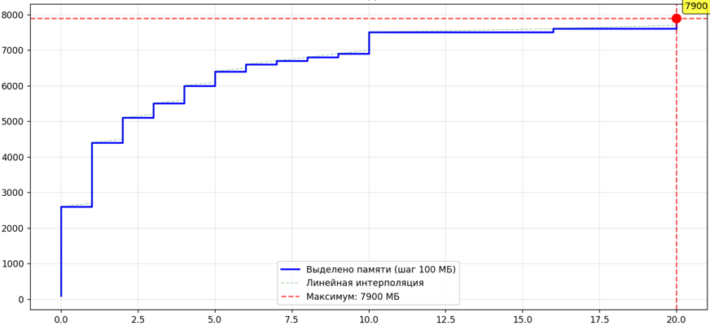
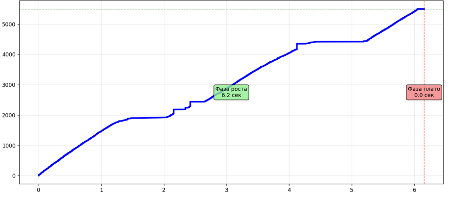

# memory-pressure-research

Comparative study of memory exhaustion behavior on Linux and Windows — measuring allocation rates, OS response time, and memory management strategies under extreme memory pressure.

## Overview

A memory bomb continuously allocates and fills memory pages with zeros until the system runs out of memory. This project implements memory bombs for both Linux (`mmap`) and Windows (`VirtualAlloc`), logs allocation progress with timestamps, and visualizes how each OS responds to extreme memory pressure.

The core research question: **how do Linux's OOM Killer and Windows's Memory Manager differ in their strategies for handling memory exhaustion?**

## Key Findings

| Metric | Linux (`mmap`) | Windows (`VirtualAlloc`) |
|---|---|---|
| Allocation strategy | 100 MB chunks, page-by-page fill | Page-by-page allocation |
| Time before intervention | ~60+ seconds | ~20 seconds |
| OS response | OOM Killer terminates the process | Memory Manager blocks further allocation |
| Approach | Reactive — allows exhaustion, then kills | Preventive — limits allocation early |
| Recovery | Process killed, system survives | No crash, system remains stable |

## Results

**Linux** — memory grows linearly in 100 MB steps until OOM Killer intervenes:



**Windows** — rapid allocation growth, then a hard plateau when VirtualAlloc starts failing after ~20 seconds:



## Project Structure

```
memory-pressure-research/
├── linux/
│   └── membomb.c           # mmap-based memory bomb with CSV logging
├── windows/
│   └── membomb.c           # VirtualAlloc memory bomb with CSV logging
├── analysis/
│   ├── plot_linux.py       # Parses memlog.csv and plots memory growth
│   ├── plot_windows.py     # Parses memory_log.csv and plots memory growth
│   └── graphs/             # Generated plots
├── requirements.txt
└── .gitignore
```

## Getting Started

### Prerequisites

```bash
pip install -r requirements.txt
```

### Running (Linux)

> ⚠️ **WARNING**: This will consume all available RAM and trigger the OOM Killer. Run only in a VM with a snapshot.

```bash
gcc linux/membomb.c -o membomb
./membomb
```

The program logs allocation progress to `memlog.csv`. Generate the plot:

```bash
python analysis/plot_linux.py
```

### Running (Windows)

> ⚠️ **WARNING**: Same as above. Save all work and take a VM snapshot before running.

```bash
gcc windows/membomb.c -o membomb.exe
./membomb.exe
```

The program logs to `memory_log.csv`. Generate the plot:

```bash
python analysis/plot_windows.py
```

## How It Works

**Linux implementation** uses `mmap()` with `MAP_PRIVATE | MAP_ANONYMOUS` to allocate 100 MB chunks. Each chunk is filled page-by-page (4096 bytes at a time) with zeros to force physical memory commitment — without this, Linux would use lazy allocation and not actually consume RAM. When physical memory is exhausted, the kernel's OOM Killer selects and terminates the process with the highest memory score.

**Windows implementation** uses `VirtualAlloc()` with `MEM_COMMIT | MEM_RESERVE` to allocate individual pages. The Memory Manager tracks committed memory against the system commit limit (RAM + page file). Once the limit is approached, `VirtualAlloc` returns `NULL` and the program exits gracefully — no process termination required.

## OOM Killer vs Memory Manager

The fundamental difference is philosophical:

- **Linux OOM Killer** is *reactive*: the kernel lets processes allocate freely until physical memory is truly exhausted, then forcibly kills the worst offender. This maximizes resource utilization but can cause sudden process termination.
- **Windows Memory Manager** is *preventive*: allocation requests are rejected before the system reaches a critical state. This trades utilization for stability — processes never crash unexpectedly, but they may be denied memory earlier than strictly necessary.

## Tech Stack

- C (Linux syscalls via `mmap`, Windows API via `VirtualAlloc`)
- Python, pandas, Matplotlib

## License

MIT
